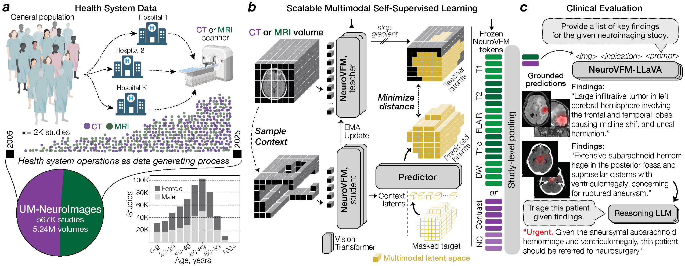

# NeuroVFM

## Health system learning enables generalist neuroimaging models

[**Paper**](https://www.nature.com/articles/s41591-026-04497-1) / [**Interactive Demo**](https://neurovfm.mlins.org) / [**Models**](https://huggingface.co/collections/mlinslab/neurovfm) / [**MLiNS Lab**](https://mlins.org)

**NeuroVFM** is a volumetric foundation model for multimodal neuroimaging, trained with self-supervision on **5.24M** MRI/CT volumes (**567k** studies) spanning **20+ years** of routine clinical care at Michigan Medicine.

> **Research use only.** Not a medical device. Do not use for clinical decision-making.



---

The NeuroVFM stack includes:

- **3D ViT encoder**, general-purpose representations for *any* clinical neuroimage (T1, T2, FLAIR, DWI, CT, etc.)
- **Study-level diagnostic heads**, covering **74 MRI**/**82 CT** expert-defined diagnoses for *any* neuroimaging study
- **Findings LLM**, generates preliminary findings given *any* neuroimaging study plus clinical context
- **Reasoning API**, pass outputs to a frontier reasoning model for higher-level tasks (e.g., triage)

All pretrained models are hosted on [Hugging Face](https://huggingface.co/collections/mlinslab/neurovfm). Weights require access approval with an institutional email.

---

## Quickstart

### Installation

```bash
git clone https://github.com/MLNeurosurg/neurovfm.git
cd neurovfm
pip install -e .
```

[FlashAttention-2 v2.6.3](https://github.com/Dao-AILab/flash-attention) built from source is required for both training and inference (fused dense/MLP and DropAddNorm kernels must be enabled). See the flash-attn README for GPU, CUDA, and PyTorch compatibility.

### Pipeline

```python
from neurovfm.pipelines import load_encoder, load_diagnostic_head, load_vlm, interpret_findings

encoder, preprocessor = load_encoder("mlinslab/neurovfm-encoder")
dx_head = load_diagnostic_head("mlinslab/neurovfm-dx-ct")
generator, gen_preproc = load_vlm("mlinslab/neurovfm-llm")

batch = preprocessor.load_study("/path/to/ct/study/", modality="ct")

embeddings = encoder.embed(batch)                   # [N_tokens, 768]
predictions = dx_head.predict(embeddings, batch)    # [(label, prob, pred), ...]

vols = gen_preproc.load_study("/path/to/ct/study/", modality="ct")
findings = generator.generate(vols, clinical_context="LOC and nausea.")

# (Optional) External reasoning model for triage
triage = interpret_findings(findings, "LOC and nausea.", api_key="...")
```

See `examples/` for complete runnable scripts for each stage.

---

## Training

Configs and reference scripts are provided for encoder pretraining (Vol-JEPA), diagnostic head training (MIL), and findings model fine-tuning (SFT). See [`neurovfm/train/README.md`](neurovfm/train/README.md) for details.

---

## Repository structure

```
neurovfm/
├── data/               # Data loading & preprocessing (NIfTI, DICOM, caching)
├── datasets/           # PyTorch datasets, samplers, collators, data modules
├── models/             # 3D ViT, MIL poolers, VLM, Perceiver connector
├── systems/            # Lightning training: Vol-JEPA, classification, SFT
├── pipelines/          # Inference APIs (encoder, diagnostic, VLM, triage)
├── optim/              # Optimizers and LR schedulers
├── train/              # Training scripts (Vol-JEPA pretraining, classification heads, LLM fine-tuning)
examples/               # End-to-end example scripts
```

---

## Projects using NeuroVFM

<!-- Add publications that use NeuroVFM here. Format: citation + brief description + link. -->

| Paper | Description | Link |
|---|---|---|
| Heras Rivera, Low, et al. "CoRe-BT: A Multimodal Radiology-Pathology-Text Benchmark for Robust Brain Tumor Typing." (2026) | Uses NeuroVFM encoder for MRI embeddings in multimodal brain tumor typing | [arXiv:2603.03618](https://arxiv.org/abs/2603.03618) |
<!-- | Author et al. "Title." (Year) | Brief description | [Link]() | -->

## License

Code is released under the **MIT License**. Model weights are provided under **CC-BY-NC-SA 4.0** on [Hugging Face](https://huggingface.co/collections/mlinslab/neurovfm). Some weights require access approval with an institutional email.

## Citation

```bibtex
@misc{kondepudi2025healthlearningachievesgeneralist,
  title={Health system learning achieves generalist neuroimaging models},
  author={Akhil Kondepudi and Akshay Rao and Chenhui Zhao and Yiwei Lyu and Samir Harake and Soumyanil Banerjee and Rushikesh Joshi and Anna-Katharina Meissner and Renly Hou and Cheng Jiang and Asadur Chowdury and Ashok Srinivasan and Brian Athey and Vikas Gulani and Aditya Pandey and Honglak Lee and Todd Hollon},
  year={2025},
  eprint={2511.18640},
  archivePrefix={arXiv},
  primaryClass={cs.CV},
}
```
